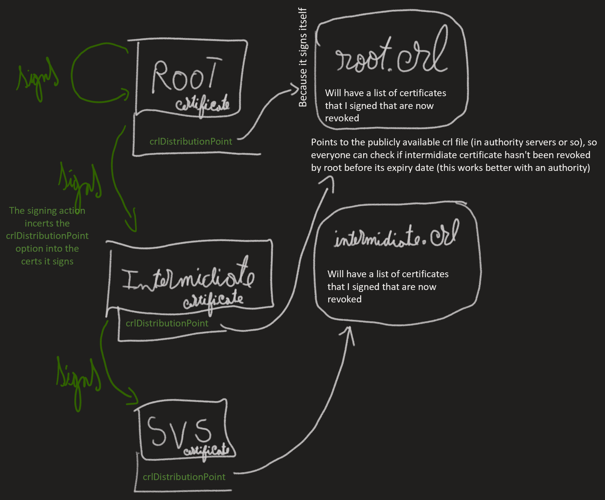

<h1> SecurityInDistributedSystems Notes </h1>

DockerFiles, Certificate chains, Apache Server, Basic Authentication...

- [1. certificates](#1-certificates)
  - [1.1. Tutorials](#11-tutorials)
  - [1.2. Creation](#12-creation)
    - [1.2.1. Making Root, intermidiate & svs certificates](#121-making-root-intermidiate--svs-certificates)
    - [1.2.2. Stich the 3 together in a bundle with this site](#122-stich-the-3-together-in-a-bundle-with-this-site)
    - [1.2.3. Adding CRL revogation lists](#123-adding-crl-revogation-lists)
  - [1.3. Understanding the certs & hierarchy](#13-understanding-the-certs--hierarchy)
  - [1.4. Random Notes](#14-random-notes)
  - [1.5. Credentials](#15-credentials)
  - [1.6. Make browser be able to accept it as a certificate authority](#16-make-browser-be-able-to-accept-it-as-a-certificate-authority)
- [2. ssh](#2-ssh)
  - [2.1. ssh without password (using a public and a private key)](#21-ssh-without-password-using-a-public-and-a-private-key)
  - [2.2. setting up ssh tunneling to connect and send files to the server](#22-setting-up-ssh-tunneling-to-connect-and-send-files-to-the-server)
  - [2.3. Credentials](#23-credentials)
  - [2.4. Random Notes](#24-random-notes)
- [3. web server](#3-web-server)
  - [3.1. Link to server](#31-link-to-server)
  - [3.2. Check the Certificate Quality](#32-check-the-certificate-quality)
  - [3.3. Credentials](#33-credentials)
- [4. Docker](#4-docker)
  - [4.1. Commands](#41-commands)
- [5. Firewall](#5-firewall)
  - [5.1. 6.1 Install and configure IPTables](#51-61-install-and-configure-iptables)
- [6. Professor](#6-professor)
  - [6.1. Questions](#61-questions)
  - [6.2. Notices](#62-notices)

## 1. certificates

### 1.1. Tutorials

- [PKI guide from professor](https://pki-tutorial.readthedocs.io/en/latest/#), It talks about the 3 layered structure in the [Advanced PKI Example](https://pki-tutorial.readthedocs.io/en/latest/advanced/index.html)
- <s>[Our Tutorial](https://www.golinuxcloud.com/openssl-create-certificate-chain-linux/#Root_vs_Intermediate_Certificate) (didn't end up working)</s>
- [JusT](https://github.com/JOSEALM3IDA)'s suggested [tutorial](https://superuser.com/questions/126121/how-to-create-my-own-certificate-chain)
- [Carol's](https://github.com/carolinafigueiredo1?tab=repositories) suggested [tutorial](https://pki-tutorial.readthedocs.io/en/latest/advanced/index.html) (the one that worked!)  

### 1.2. Creation

#### 1.2.1. Making Root, intermidiate & svs certificates

Check `DockerBlueprintApacheServ/certs/regenerate_certs.sh` for all the command to be ran.  

Using [Carol's](https://github.com/carolinafigueiredo1?tab=repositories) suggested [tutorial](https://pki-tutorial.readthedocs.io/en/latest/advanced/index.html):

1. Starting with just the conf files

      ```txt
      ├── etc
      │   ├── openssl_changed.conf
      │   ├── root-ca.conf
      │   ├── server.conf
      │   └── tls-ca.conf
      ```

2. [Create Root CA](https://pki-tutorial.readthedocs.io/en/latest/advanced/index.html#create-root-ca)
3. [Create TLS (intermidiate) CA](https://pki-tutorial.readthedocs.io/en/latest/advanced/index.html#create-tls-ca)
4. [Create TLS server certificate](https://pki-tutorial.readthedocs.io/en/latest/advanced/index.html#operate-tls-ca) until ~6.3.
    1. This with all the infor for the haw server:

      ```conf
      ## TLS server Configuration File

      [ default ]
      SAN                     = DNS:ful.informatik.haw-hamburg.de

      [ req ]
      default_bits            = 4096
      encrypt_key             = no
      default_md              = sha256
      string_mask             = nombstr
      prompt                  = yes
      distinguished_name      = server_dn
      req_extensions          = server_reqext
      prompt = no

      [ server_dn ]
      countryName             = DE
      stateOrProvinceName     = Hamburg
      organizationName        = haw-hamburg
      organizationalUnitName  = SVS
      commonName              = svs24.ful.informatik.haw-hamburg.de

      [ server_reqext ]

      keyUsage                = critical,digitalSignature,keyEncipherment
      extendedKeyUsage        = serverAuth,clientAuth
      subjectKeyIdentifier    = hash
      subjectAltName          = $ENV::SAN

      ```

    2. notice how we also had to add `prompt = no` for it to work

#### 1.2.2. Stich the 3 together in a bundle [with this site](https://cleantalk.org/help/ssl-ca-bundle)

It has to be in the right order:  
`cat ./certs/svs24.ful.informatik.haw-hamburg.de.crt ./ca/tls-ca.crt ./ca/root-ca.crt > ./ca/svs24.ca-bundle`

#### 1.2.3. [Adding CRL revogation lists](https://jamielinux.com/docs/openssl-certificate-authority/certificate-revocation-lists.html#re-create-the-crl)

1. Check `apache2-user-config.conf` file
    1. You have to make the crl files publicly available. So add the root (`root-ca.crl`) and intermidiate (`tls-ca.crl`) crl files in the apache server in the http zone, so you can access it through `http:xxxx/root-ca.crl`
    2. [We also made them inaccessible in https](https://serverfault.com/questions/22577/how-to-deny-the-web-access-to-some-files)
2. The certificates have to add their own revocation list to the certs they sign. the root will add its own crl, and the intermidiate will add its own
    1. Add `crlDistributionPoints = URI:http://svs24.ful.informatik.haw-hamburg.de/root-ca.crl` in the `root-ca.conf` file
    2. Add `crlDistributionPoints = URI:http://svs24.ful.informatik.haw-hamburg.de/tls-ca.crl` in the `tls-ca.conf` file

### 1.3. Understanding the certs & hierarchy

0. Check `DockerBlueprintApacheServ/certs/regenerate_certs.sh` for all the command to be ran.  
1. `openssl req` creates a a certificate  
   `openssl ca` signs a certificate with another
2. The root places in the certs it signs a crlDistributionPoints section pointing to root's crl file (which is a list of revoked certs it signed) publicly available in roots server, so root can revoke certs it signs before their expiration if need be.
    1. The root certificate has in its "signing other certs configuration" `crlDistributionPoints = URI:http:xxxx/root-ca.crl`. Which is the `[ signing_ca_ext ]` section in `root-ca.conf`
    2. You can notice, when you sign other certs with root, we call this section in `root-ca.conf`

      ```bash
        echo "3.4 Creating intermidiate certificate"
        openssl ca \
            -config etc/root-ca.conf \
            -in ca/tls-ca.csr \
            -out ca/tls-ca.crt \
            -extensions signing_ca_ext # !!!
      ```

3. As root is self signing, its `crlDistributionPoints` points to its wn list
4. Check the following image to understand the hierarchy:



1. That is one chain, the other chain is with the root cert & team cert, and is used for user athentication
   1. The apache uses that root-team_cert chain, so it accepts all the certificates that were signed by that team certificate. (check the apache2-user-config.conf file)
   2. The user has a certificate that was signed by the team certificate, basically the user needs:
      1. Linux:
         - A pfx file wich has the key and the key of the user certificate.
         - The root, team & user crt certificate files to add to the linux system ([see this for manjaro instructions](https://warlord0blog.wordpress.com/2021/01/17/trusting-ca-certificates-manjaro/))
      2. Windows:
         - A pfx file wich has the key and the key of the user certificate.
         - A p7b Microsoft file made out of all the other certificates to add to windows systems.

### 1.4. Random Notes

- Letters meaning in creation of certificates:

  ```txt
    CN: CommonName  
    OU: OrganizationalUnit  
    O: Organization  
    L: Locality  
    S: StateOrProvinceName  
    C: CountryName 
  ```

### 1.5. Credentials

- Our certificates passphrase: *Stunt-Headwear-Lung1*

### 1.6. [Make browser be able to accept it as a certificate authority](https://serverfault.com/questions/919768/cannot-add-a-self-signed-certificate-in-firefox)

## 2. ssh

### 2.1. ssh without password (using a public and a private key)

- Watch [this](https://www.youtube.com/watch?v=lKXMyln_5q4)

### 2.2. setting up [ssh tunneling](https://superuser.com/questions/456438/how-do-i-scp-a-file-through-an-intermediate-server) to connect and send files to the server

- add this to your ~/.ssh/config file:

  ```txt
  HOST haw
      HostName hop-ful.informatik.haw-hamburg.de
      User Joao.SilvadeAlmeida@haw-hamburg.de
    
  HOST svs24
      HostName svs24.ful.informatik.haw-hamburg.de
      User otto
      ProxyJump haw
  ```

- You can then ssh with `ssh svs24`
- Or copy files to there with: `scp ./folderName.tgz svs24:~`

### 2.3. Credentials

- When doing `ssh haw`:
  - First input your password for your haw account
  - Input the machine's password: *BigDickEnergy* *(should change)*

### 2.4. Random Notes

- If you wanted to login without typing a password, you had to put the public key of your computer on the remote servers, and do ssh tunneling somehow.
- Go to the server and in a .ssh put my public key from your PC..?

## 3. web server

- apache:
  - configuration at `DockerBlueprintApacheServ/apache2-user-config.conf`  
  or inside container: `/etc/apache2/sites-available/webportal.conf`
  - html at `DockerBlueprintApacheServ/userdata/webportal/index.html`  
  or inside container: `/userdata/webportal/index.html`

### 3.1. [Link to server](https://svs24.ful.informatik.haw-hamburg.de/)

### 3.2. [Check the Certificate Quality](https://www.ssllabs.com/ssltest/analyze.html?d=svs24.ful.informatik.haw%2dhamburg.de&latest)

### 3.3. Credentials

- Basic Authentication, used [this](https://www.youtube.com/watch?v=00bwCjPp-FU&ab_channel=TonyTeachesTech) to setup
  - User: admin
  - Paswword: Stunt-Headwear-Lung1

## 4. Docker

### 4.1. Commands

- switch to inside running docker image: `docker exec -t -i svs /bin/bash`
- Command to delete everything and restart everything:

  ```bash
  docker rm -vf $(docker ps -aq) ; docker rmi -f $(docker images -aq) ; docker build -t svs:latest . ; docker run -d -p 80:80 -p 443:443 --name svs svs:latest
  ```

## 5. Firewall

### 5.1. 6.1 Install and configure IPTables

- Installation and configuration, used [this](https://www.hostinger.com/tutorials/iptables-tutorial) and [this](https://www.youtube.com/watch?v=qPEA6J9pjG8)
- For scheduled commands as a safeguard, we used [this](https://www.computerhope.com/unix/uat.htm)
- iptables-apply - a safer way to update iptables remotely

  ```bash
  iptables-apply [-hV] [-t timeout] [-w savefile] {[rulesfile]|-c [runcmd]}
  ```

- We the command

```bash
at 
```

to create safeguard before appending rules to revert to safe ruleset after certain amount of time (this case 5 minutes)

  ```bash
  sudo at -vM now +5 minutes 
  ```

  This can used to view if there are any scheduled commands and when they will be executed

  ```bash
  atq
  ```

  Text editor will prompt for commands to be scheduled - we type

  ```bash
  iptables-restore /etc/iptables/1st_ruleset.v4 
  ```

  This is a safestate with SSH access.
  
## 6. Professor

### 6.1. Questions

- Are Revogation lists set up correctly?
- How to make browser accept our certificate?, we have the thing in [this](https://serverfault.com/questions/919768/cannot-add-a-self-signed-certificate-in-firefox) site, but it still doesn't work?

### 6.2. Notices

- JusT:
Tem 2 dockers a correr, backend e o normal
